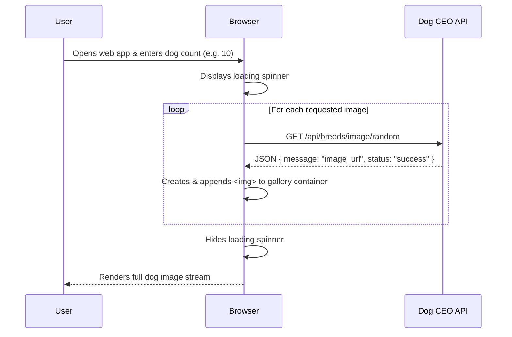

# 🐶 DogStream-API — Real-Time Dog Image Gallery

[](https://developer.mozilla.org/en-US/docs/Web/JavaScript)
[](https://axios-http.com/)
[](https://dog.ceo/dog-api/)

**DogStream-API** is a clean, responsive front-end web application that fetches and streams adorable, unique dog pictures in real-time from the public **Dog CEO REST API**. 

It serves as an introductory project demonstrating practical asynchronous JavaScript, REST API consumption with Axios, dynamic DOM manipulation, and responsive image grid layouts.

---

## 🌟 Key Features

* **⚡ On-Demand Fetching**: Prompts the user for how many dog images they want to view (from 1 up to 100 images).
* **🔄 Asynchronous REST Integration**: Uses `async/await` and `axios.get()` to query `https://dog.ceo/api/breeds/image/random`.
* **⏳ Dynamic Loading State**: Displays a clean loading spinner while images are being fetched from the remote API.
* **📱 Responsive Image Grid**: Flexbox and CSS Grid styling to present images cleanly across mobile and desktop screens.
* **⬆️ Smooth Back-To-Top Button**: Appears dynamically upon scrolling down and smoothly returns the user to the top of the gallery.

---

## 🏗️ How It Works



---

## 📁 Repository Structure

```text
DogStream-API/
├── index.html       # HTML structure, viewport settings & Axios CDN script
├── style.css        # Responsive gallery styling, animations & back-to-top button
└── app.js           # API fetch logic, DOM creation, and scroll listeners
```

---

## 🚀 Quick Start Guide (For Beginners)

Running this project locally requires **no installation or build steps**!

### 1. Clone the Repository
```bash
git clone https://github.com/kaustubh12022/DogStream-API.git
cd DogStream-API
```

### 2. Open in Browser
Simply double-click `index.html` in your file explorer, or open it via any local server:

**Using Python:**
```bash
python -m http.server 8000
```
Then visit `http://localhost:8000` in your web browser.

---

## 📄 License

This project is open-source and free to use for learning and development.
